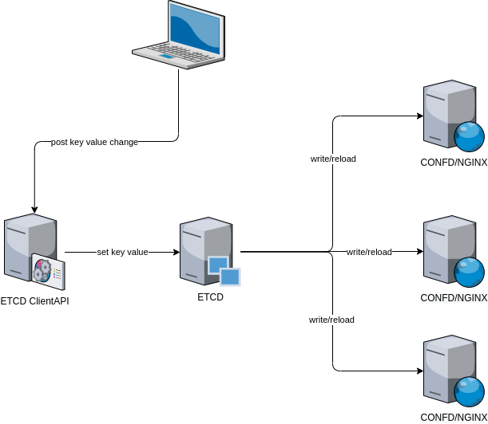

# 1. Introduction
A minimal docker-compose setup with Nginx which is dynamically configured using Confd and etcd for it's key value store. Confd support a fairly good number of backends but for this example etcd was the chosen implementation. Etcd uses Raft which is a consensus algorithm to ensure data integrity. Even though this example doesn't use it, Confd-Etcd support TLS/SSL to encrypt and protect the transfer of data between the etcd and confd servers.

##### Backends

- etcd

- consul

- vault

- environment variables

- file

- redis

- zookeeper

- dynamodb

- rancher

- ssm (AWS Simple Systems Manager Parameter Store)

  

[etcd](https://etcd.io/),  

[bitnami/etcd (from dockerhub)](https://hub.docker.com/r/bitnami/etcd/), 

[confd](https://github.com/kelseyhightower/confd)




### Confd Configuration Files

default.conf.toml

```
[template]
backend = "etcdv3"

log-level = "debug"
interval = 60
noop = false
watch = true

src = "default.conf.tmpl"
dest = "/etc/nginx/conf.d/default.conf"

keys = [
    "/nginx/domain"
]

nodes = [
  "http://10.5.0.100:2379",
]

check_cmd = "nginx -t"
reload_cmd = "nginx -s reload"
```

default.cond.tmpl

```
server {
    listen       80;
    listen  [::]:80;
    server_name  {{getv "/nginx/domain"}};

    #charset koi8-r;
    #access_log  /var/log/nginx/host.access.log  main;

    location / {
        root   /usr/share/nginx/html;
        index  index.html index.htm;
    }

    #error_page  404              /404.html;

    # redirect server error pages to the static page /50x.html
    #
    error_page   500 502 503 504  /50x.html;
    location = /50x.html {
        root   /usr/share/nginx/html;
    }
}
```


# 2. Quick Start Guide

```
docker-compose up --build 
```

### 2.1 Log into the confd-nginx server
```
docker exec -it nginx-server sh
```

##### Set Confd to either onetime update, polling or watch

```
confd -interval=5 -backend etcdv3 -node http://10.5.0.100:2379 & polling on time
```

*If using **-onetime**, you need to set the etcd value in your key store first (see step 2.3)*

```
confd -onetime -log-level "debug" -backend etcdv3 -node http://10.5.0.100:2379
```

##### Look at the server_name value (should be the initial value 'hostname')
```
cat /etc/nginx/conf.d/default.conf
...
server_name localhost;
```

### 2.2 Log into the etcd server

```
docker exec -it etcd-server /bin/bash
```

Insert a server_name keypair into the etcd server.

```
etcdctl put /nginx/domain 'telushealth.com'
```

Go back into the confd-nginx server and look at the NGINX config. The **server_name** value should be: 

```
cat /etc/nginx/conf.d/default.conf
...
server_name telushealth.com;
```

## 3. Managing Configurations Using an ETCD Client and Cluster

curl http://10.5.0.100:2379/v3/keys/nginx/domain -XPUT -d value="telushealth.com"
